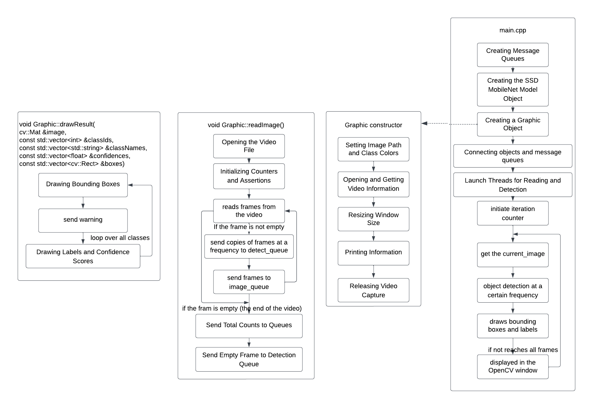

# CppND-Capstone-SSD-Object-Detection

[demo](https://drive.google.com/file/d/1XUSKXu-G87XQyCqey40H_eJu593En7O-/view?usp=sharing)

 
##  Description
This is a Capstone Project (Option 1 Object detector using OpenCV) for Udacity Nanodegree in C++. 

This an Object Detection with Collision Warning Application used in Robotic Automation Navigation. The project takes input from either a video stream or an image. The detected objects are highlighted with bounding boxes and labeled with their respective class names.  If the detected objects are within a certain distance of the robotic system, a collision warning message is displayed on the terminal. The project involves real-time processing, where the object detection and collision warning are performed in near-real-time as the video frames or images are processed. 

## Features 

* Object Detection using MobileNet SSD(Single Shot MultiBox Detector) Model with OpenCV
* User Input and Display
* Collision Warning 
* Real-time Processing

## Dependencies  
 
- OpenCV >= 4 
  - [Install instruction for Linux](https://docs.opencv.org/4.1.1/d7/d9f/tutorial_linux_install.html)
  - [Install istruction for Windows](https://www.learnopencv.com/install-opencv-4-on-windows/)
  - [Install instruction for Mac](https://www.learnopencv.com/install-opencv-4-on-macos/)
- cmake >= 3.7
    * All OSes: [click here for installation instructions](https://cmake.org/install/)
- make >= 4.1 (Linux, Mac), 3.81 (Windows)
    * Linux: make is installed by default on most Linux distros
    * Mac: [install Xcode command line tools to get make](https://developer.apple.com/xcode/features/)
    * Windows: [Click here for installation instructions](http://gnuwin32.sourceforge.net/packages/make.htm)
- gcc/g++ >= 5.4
    * Linux: gcc / g++ is installed by default on most Linux distros
    * Mac: same deal as make - [install Xcode command line tools](https://developer.apple.com/xcode/features/)
    * Windows: recommend using [MinGW](http://www.mingw.org/)

## Download models (Optional)

MobileNet SSD Models were already downloaded in this project. 
Here shows how to download those models if needed.

In the root directory (this repository), execute the command below:

1. `mkdir models`

2.  download the model file 

    `wget https://github.com/rdeepc/ExploreOpencvDnn/raw/master/models/frozen_inference_graph.pb -O models/frozen_inference_graph.pb`

3. download the config file

    `wget https://github.com/rdeepc/ExploreOpencvDnn/raw/master/models/ssd_mobilenet_v2_coco_2018_03_29.pbtxt -O models/ssd_mobilenet_v2_coco_2018_03_29.pbtxt`

4. download the objection classes file to show results

    `wget https://raw.githubusercontent.com/opencv/opencv/master/samples/data/dnn/object_detection_classes_coco.txt  -O models/object_detection_classes_coco.txt `

## Build

In the root directory (this repository), execute the command below:

1. `rm -rf build` (optional)
2. `mkdir build`
3. `cd build`
4. `cmake ..`
5. `make`

## Run

In `build` directory, run the executable like below:

`./detect [options] <image file>`
 

#### Options

- `-c` : specifies _confidence threshold_ between 0 and 1.0. If omitted, default value is 0.5. (example: `-c=0.3`)
- `-n` : specifies the threshold used for _Non-max Suppression_ between 0 and 1.0. If omitted, default value is 0.5. (example: `-n=0.7`)
- `-h` `-?` `--help` `--usage`: Show usage.

#### Example

`./detect -c=0.8 ../images/collision_avoidance.mp4`

`./detect -c=0.7 -n=0.4 ../images/orange.mp4`
 

## File and Class Structure

1. `CMakeLists.txt`

    CMake configuration file sets up the project with the necessary compiler flags, finds and includes the OpenCV library, defines the source files, and links the executable with the required libraries, ensuring that dependencies are correctly linked and the correct compiler flags are used.

2. `main.cpp`

    This function processes images, performs object detection using an SSD model, and displays the detection results on a window. It processes images in a loop, detects objects periodically, and updates the display with the detection results.
    
3. `MessageQueue.h`

    Class MessageQueue is designed to manage a queue of messages that can be sent and received concurrently by different threads, using mutexes and condition variables to ensure proper synchronization and thread safety. 

4. `Graphic.h` and `Graphic.cpp`

    Class Graphic is responsible for handling images, drawing object detection results on images, sending message to the terminal for collision warning and managing message queues for communication.  

5. `SSDModel.h` and `SSDModel.cpp`

    Class SSDModel encapsulates the entire object detection pipeline using the SSD MobileNet model. It initializes the model, processes images for object detection, and handles synchronization between threads using mutexes and condition variables.  
 

## Program Schematic

## Reference
[opencv_dnn_SSD](https://github.com/opencv/opencv/blob/master/samples/dnn/object_detection.cpp)

## Rubric Points

1. README 

    1.1 A README with instructions is included with the project.  
    * Dependencies
    * Download models (Optional)
    * Build  
    * Run

    1.2 The README indicates which project is chosen.
    * Description
    * Features
    * File and Class Structure

    1.3 The README includes information about each rubric point addressed. 
    * Rubric Points

2. Compiling and Testing
    * Build
    * Run

3. Loops, Functions, I/O

    3.1 The project demonstrates an understanding of C++ functions and control structures. 
    * Graphic.cpp line 96 : `void Graphic::readImage(); `
    * Main.cpp line 98 - 115 : `while(cv::waitKey(duration) < 0);`
    * SSDModel.cpp 

        line 58 - 91 : `void SSDModel::objectDetection();`
        
        line 98 - 148 : `std::vector<int> SSDModel::detect(const cv::Mat &image,
                                    std::vector<int> &classIds,
                                    std::vector<float> &confidences,
                                    std::vector<cv::Rect> &boxes);`

    3.2 The project reads data from a file and process the data, or the program writes data to a file. 
    * SSDModel.cpp 

        line 150 - 160 : `void SSDModel::readClassFile();`
        
        line 163 - 175 : `void SSDModel::loadModel();`

    3.3 The project accepts user input and processes the input. 
    * main.cpp line 28 - 59 : `cv::CommandLineParser parser(argc, argv, keys);`
 
4. Object Oriented Programming

    4.1 The project uses Object Oriented Programming techniques.
    * Graphic.h line 8 - 46 : `class Graphic `
    * SSDModel.h line 9 - 62 : `class SSDModel`
    * MessageQueue.h line 9 - 67 : `class MessageQueue`

    4.2 Classes use appropriate access specifiers for class members.     
    4.3 Class constructors utilize member initialization lists.
    * Graphic.cpp line 14 - 15 : `Graphic::Graphic(std::string _img_path, int class_num) : image_path(_img_path) {...}`
    * SSDModel.cpp line 17 - 21 : `SSDModel::SSDModel(float _conf_threshold, float _nms_threshold)
        : conf_threshold(_conf_threshold), nms_threshold(_nms_threshold){...}`
 
    4.5 Classes encapsulate behavior. 
 
    * MessageQueue.h line 61 - 65 :
        `private: std::mutex _mutex;  std::condition_variable _cond; std::deque<T> _messages; int _total = 0;`
    * Graphic.h line 26 - 45 :
    `private: 
    // Information about the input video 
    // thread for reading images 
    // pointer for the queue to send images being read 
    // colors being assigned to classes randomly`
    * SSDModel.cpp line 23 - 60:
     ` private:
    // Detection threshold 
    // SSD MobileNet Model files  
    // Parameters for SSD MobileNet (fixed) 
    // Store the list of classe name 
    // DNN model 
    // Information about detected objects 
    // thread for detection  `

    4.9 Templates generalize functions in the project.
    * MessageQueue.h line 8 - 66 : `template <typename T> class MessageQueue{};`

5. Memory Management

    5.1 The project makes use of references in function declarations.

    * Graphic.h line 13 - 17 : `void drawResult(cv::Mat &image, 
                    const std::vector<int> &classIds,
                    const std::vector<std::string> &classNames,
                    const std::vector<float> &confidences,
                    const std::vector<cv::Rect> &boxes);`
    * SSDModel.h 
    
        line 18 - 21 : `void getNextDetection(std::vector<int> &classIds,
                            std::vector<std::string> &classNames,
                            std::vector<float> &confidences,
                            std::vector<cv::Rect> &boxes);`

        line 56 - 58 : `std::vector<int> detect(const cv::Mat &image, std::vector<int> &classIds,
                                        std::vector<float> &confidences,
                                        std::vector<cv::Rect> &boxes);`

    5.2 The project uses destructors appropriately. 
    * Graphic.cpp line 34 : `Graphic::~Graphic() { read_thread.join(); }`
    * SSDModel.cpp line 23 : `SSDModel::~SSDModel() { detection_thread.join(); }` 
 
    5.4 The project follows the Rule of 5
    * SSDModel.h

        line 14 : `SSDModel(const SSDModel &) = delete;`
 
        line 17 : ` SSDModel &operator=(const SSDModel &) = delete;`
    * Graphic.h

        line 14 : `Graphic(const Graphic &) = delete;`
        
        line 17 :`  Graphic &operator=(const Graphic &) = delete;`

    5.5 The project uses move semantics to move data, instead of copying it, where possible.
    * Graphic.cpp 

        line 120 : `detect_queue->send(std::move(frame1));`

        line 123 : `image_queue->send(std::move(cv::Mat(frame)));`

        line 133 : `detect_queue->send(std::move(cv::Mat()));`
    * SSDModel.cpp

        line 36 - 51 :
    `void SSDModel::getNextDetection(std::vector<int> &classIds,
                                std::vector<std::string> &classNames,
                                std::vector<float> &confidences,
                                std::vector<cv::Rect> &boxes)  {...
  classIds = std::move(detect_classIds.front());...
  classNames = std::move(detect_classNames.front());...
  confidences = std::move(detect_confs.front());
  detect_confs.pop();
  boxes = std::move(detect_boxes.front());
  detect_boxes.pop();`

        line 83 - 86 :
   `void SSDModel::objectDetection(){...detect_classIds.push(std::move(classIds_out));
    detect_confs.push(std::move(confidences_out));
    detect_boxes.push(std::move(boxes_out));
    detect_classNames.push(std::move(classNames_out));...}`

    5.6 The project uses smart pointers instead of raw pointers.
    * Graphic.h line 37 - 38 : `std::shared_ptr<MessageQueue<cv::Mat>> detect_queue = nullptr;
    std::shared_ptr<MessageQueue<cv::Mat>> image_queue = nullptr;` 

6. Concurrency

    6.1 The project uses multithreading.
    * Graphic.cpp line 36 - 38 : `void Graphic::thread_for_read();`
    * SSDModel.cpp line 25 - 27 : `void SSDModel::thread_for_detection();`

    6.3 A mutex or lock is used in the project.
    * MessageQueue.h 
    
        line 14 - 27 : `T receive() {...std::unique_lock<std::mutex> ulock(_mutex);...}`
    
        line 31 - 40 :
        `void send(T &&msg)
        {...std::lock_guard<std::mutex> ulock(_mutex);...}`
        
        line 48 - 54 :
        `int getTotal() {std::lock_guard<std::mutex> ulock(_mutex);...}`

        line 55 - 59 : ` void setTotal(int total) {std::lock_guard<std::mutex> ulock(_mutex);...}`

    * SSDModel.cpp 
    
        line 41 - 42 : ` std::unique_lock<std::mutex> ulock(_mutex);
    _cond.wait(ulock, [this] { return !detect_classIds.empty(); });`
        
        line 82 : `std::lock_guard<std::mutex> ulock(_mutex);`

    6.4 A condition variable is used in the project.
    * MessageQueue.h line 63: `std::condition_variable _cond;`
    * SSDModel.cpp 
    
        line 42 : `void SSDModel::getNextDetection() {... _cond.wait(ulock, [this] { return !detect_classIds.empty(); }); ...}`
        
        line 87 : `void SSDModel::objectDetection(){... _cond.notify_one();...}`
